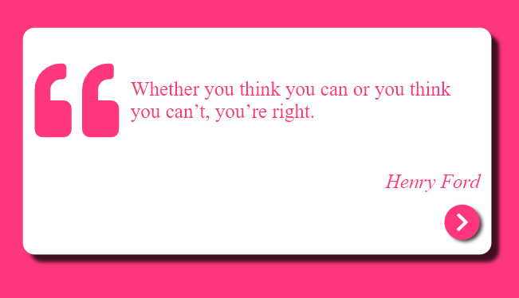

# Random Quote App

Aplicación sobre citas de personas importantes. Mientras presionas el boton, podrás ver como cambian los colores y leer lo que expresaron estas personas.

## Deploy

https://random-quotesngg.netlify.app/

## Inicia el proyecto

Si desea ver el proyecto localmente, debes clonar e instalar las dependencias para ver correctamente la App.

## Instación

### `npm install`

En el directorio del proyecto, debe usar npm i y esperar la instalación de los siguientes programas:

<ul>
  <li>react</li>
</ul>

## Inicio

### `npm start`

En el directorio del proyecto, debe usar npm start y se abrirá http://localhost:3000 en una pestaña de tu navegador predeterminado.

  

Si tienes alguna sugerencia o comentario escribeme a mi correo o a mi perfil de linkin y con gusto lo tomare en cuenta!!

LinkedIn: https://www.linkedin.com/in/nicolasggdev/

E-mail: nicolasggdev@gmail.com

# Random Quote App

Appointment application of important people. As you press the button, you can see how the colors change and read what these people expressed.

## Deploy

https://random-quotesngg.netlify.app/

## Start the project

If you want to view the project locally, you must clone and install the dependencies to properly view the App.

## Install

### `npm install`

In the project directory, you need to use npm and wait for the installation of the following programs:

<ul>
  <li>react</li>
</ul>

## Start

### `npm start`

In the project directory, you should use npm start and it will open http://localhost:3000 in a tab of your default browser.

  

If you have any suggestions or feedback, write to my email or my linkedin profile and I will gladly take it into account!!

LinkedIn: https://www.linkedin.com/in/nicolasggdev/

E-mail: nicolasggdev@gmail.com
